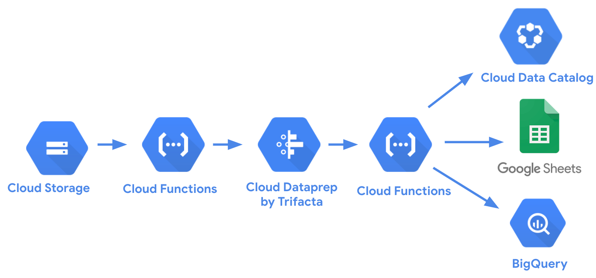

# Google Cloud Functions for Cloud Dataprep

Google Cloud Functions examples for [Google Cloud Dataprep](https://cloud.google.com/dataprep)

- **[gcs_trigger_dataprep_job.py](https://github.com/victorcouste/google-cloudfunctions-dataprep/blob/master/gcs_trigger_dataprep_job.py)** : Background Python function to trigger a Dataprep job when a file is created in a Google Cloud Storage bucket folder. Dataprep job started with REST API call and new file as parameter.

- **[job-result-google-sheet.js](https://github.com/victorcouste/google-cloudfunctions-dataprep/blob/master/job-result-google-sheet.js)** : HTTP Node.js function to write in a Google Sheet a Dataprep job result info (id, status) with recipe name, link to the job page and link to PDF of result's profile. This HTTP Cloud function is called from a Dataprep Webhook when jobs are finished (success or failure). Next step coming is to publish in a Google Sheet the file published by Dataprep.

- **[job-result-google-bigquery.py](https://github.com/victorcouste/google-cloudfunctions-dataprep/blob/master/job-result-google-bigquery.py)** : HTTP Python function to write in a Google BigQuery table a Dataprep job result info (id, status) with dataset output name (recipe name), Google user and link to the job page. This HTTP Cloud function is called from a Dataprep Webhook when jobs are finished (success or failure).

- **[export_import_dataprep_flow.py](https://github.com/victorcouste/google-cloudfunctions-dataprep/blob/master/export_import_dataprep_flow.py)** : Export a Dataprep flow from a project and import it in another project. Option to save or get the flow package (zip file) in a GCS bucket folder.

Google Cloud Functions https://cloud.google.com/functions

Google Cloud Dataprep by Trifacta https://cloud.google.com/dataprep

Google Cloud Dataprep Standard API https://api.trifacta.com/dataprep-standard

Google Cloud Dataprep Premium API https://api.trifacta.com/dataprep-premium
